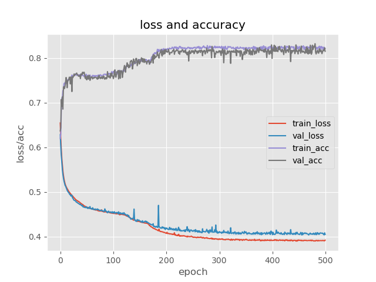
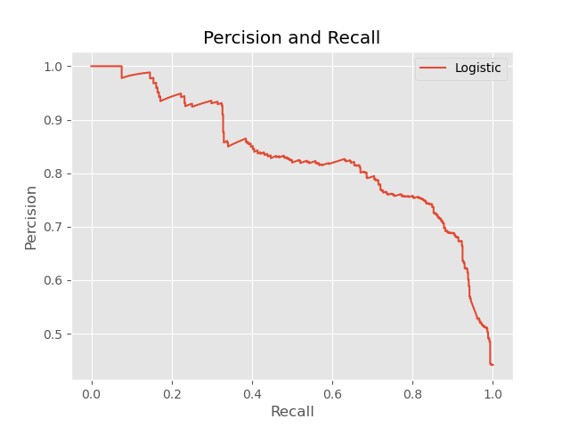
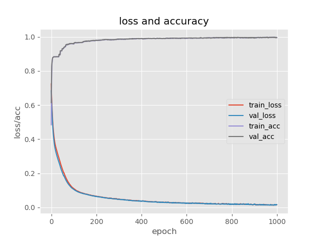
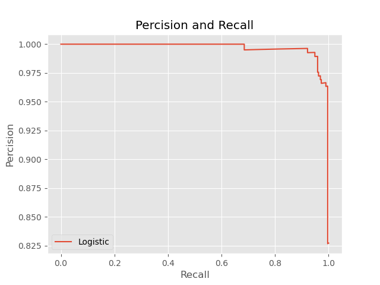
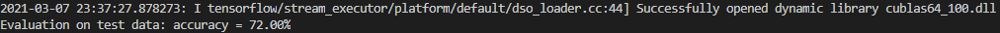
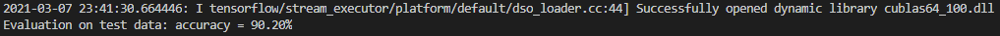

# Fall Detection Methods

## Introduction
This is a project for fall detection. In this project, there are 2 different solutions with neual network model (DNN & RNN) to achieve the fall detection task. 
DNN is to train the falling feature parameters which are introduced in the paper to make the classification.
RNN is to train the falling pose data with sequences parameter from frame to frame to make the classification.

## Requirements

Python 3.7

CudaToolkit 10.0

cuDNN 7.4

Tensorflow 2.0.0

Keras 2.2.4

## Installation 

To prepare the environment, you need to install the required environments as the requirements shows, and then run

`pip install -r requirements` 

## Data

**Feature_train_data:** Pose feature dataset of the human from the video with 3 features for training DNN.

**Feature_test_data:** Pose feature dataset of the human from the video with 3 features for testing DNN. 

**Pose_train_data:** Pose dataset of the human from the video with 75 features for training RNN. 

**Pose_test_data:** Pose dataset of the human from the video with 75 features for testing RNN. 

**Falling Feature data:** The falling feature data is extracted by `DataExtraction/FeatureExtraction.py`. It contains three main features: The speed of descent at the center of the hip joint, the human body centerline angle with the ground and the width-to-height ratio. The dataset has already been extracted in `Data/Feature_train_data.csv` and  `Data/Feature_test_data.csv`

Feature 1: The speed parameter is preprocessed by a normalization algorithm.  

Feature 2: The human body angle parameter is preprocessed by subtracting the pi/4 to seperate classification into plus and minus. 

Feature 3: The width-to-height ratio is preprocessed by subtracting 1 to separate the standing and lying into plus and minus.
*This three features are from the paper “Fall Detection Based on Key Points of Human-Skeleton Using OpenPose”*

**Pose data:** The pose data is extracted by `DataExtraction/PoseExtraction.py` It contains 75 features with human pose. The dataset has already been extracted in `Data/Pose_train_data.csv` and `Data/Pose_test_data.csv`
*Data format is BODY_25*

## Training model

Run the training code in `Train` file.

### DNN 
DNN for fall detection with falling feature data is built here. 

**To train the DNN model:**  `python train-dnn.py`

### RNN-BiLSTM 
RNN-BiLSTM for fall detection with pose data is built here. In this work, pose coordinate dataset is trained to make the classification.

**To train the RNN model:** `python train-rnn.py`

## Evaluation

To evaluate the models, accuracy and percision-recall(PR) curves are generated.

### DNN

The performance of DNN is as follows:

**Learning curve:**

**Precision-Recall curve:**

### RNN-BiLSTM

The performance of RNN is as follows:

**Learning curve:**

**Precision-Recall curve:**

## Test

Data testing are all based on the second video '192_168_53_8b'.  Run the evaluation code in `Classification` file.

### DNN

**To test the DNN model:**  `python dnn-classification.py`

### 

Accuracy: 72.00%

**Demo:**

### RNN-LSTM

**To test the DNN model:**  `python rnn-classification.py`

Accuracy: 90.20%

**Demo:**

